# 4log Products - JavaEE WebSite.
###### Thursday October 18, 2023.
###### Development by Matheus Ferreira Santos.

##
### 🚩 - Repository Goal

Nesse repositório irei mostrar o básico de **Java EE** e como você, **totalmente do 0**, pode criar um CRUD (sem o update e delete até o momento kkkkkkk) com técnologias como: Java, EclipseLink, JSP, MySQL e mais em menos de 1 hora, pelo menos foi o que eu gastei sem esse passo a passo kkkkkkkk.

#
### 📂 - Arquivos para download

Para iniciar o projeto será necessário o download de 2 arquivos, fora a IDE Netbeans e o MySQL totalmente configurado é claro, eles são:

- [X] **Apache Tomcat 8.5.91.**
- [X] **MySQL Connector/J 8.0.17.**

#
### 🐬 - MySQL Connector/J Tutorial

Entre na seguinte página: [MySQL Connector/J - Click here](https://dev.mysql.com/downloads/connector/j/)

Ao clicar no link acima ele irá abrir uma página igual a está:

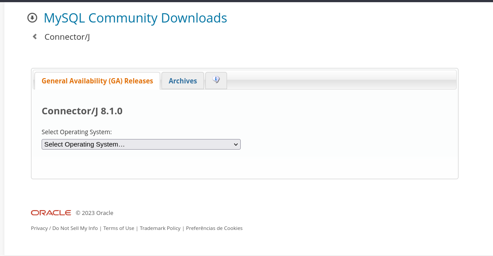

você deverá clicar em ***Archives***, ele irá te redirecionar para está página:

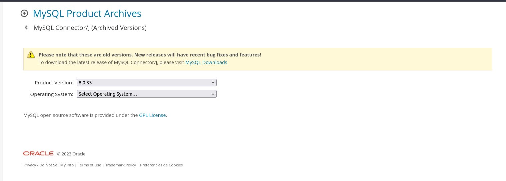

clique em ***Product Version*** e selecione: ***8.0.17***, clique em ***Operating System*** e selecione: ***Plataform Independent***, mesmo se usar Linux ou Windows, será mais fácil assim.

Se tiver feito tudo correto, a página ficará assim:

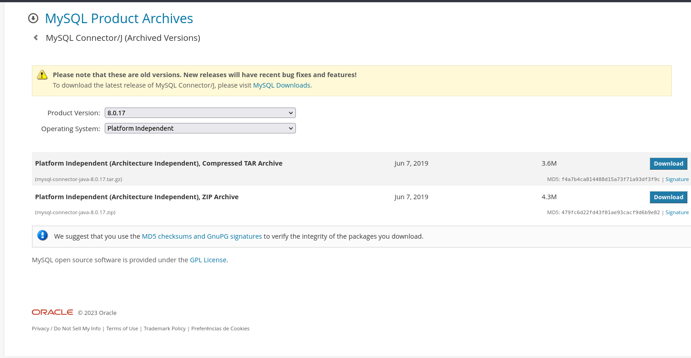

clique no segundo botão de Download e espere acabar.

> Obs.: Crie uma pasta em Documentos com o nome de ***Connectors*** e jogue o arquivo zip la dentro, pode extrair se quiser, afinal, para usar o connector dentro do projeto Java, será necessário a extração do arquivo. Faça o mesmo com o tomcat, baixe o zip, crie uma pasta ***Servers***, dentro de Documentos, e extraia o .zip do tomcat lá dentro.

### 🏁 - Inicio no NetBeans

Agora iremos começar o desenvolvimento, não é muito extenso, mas é meio chatinho.

Abra o Netbeans e clique em: **File > New Project > Java With Ant > Java Web** no painel ao lado clique em: **Web Application**, de um nome ao seu projeto e vá clique em: *Next*, você será redirecionado para uma página, na modal, como está:

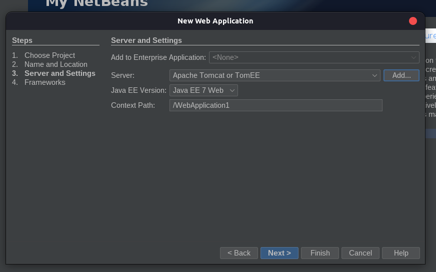

é bem provável que não tenha um servidor registrado em seu Netbeans, caso tenha, maravilha, pode clicar em *Finish* e pular para a próxima etapa, caso você não tenha um servidor configurado em sua máquina siga os seguintes passos:

1. Clique em Add, irá abrir a seguinte página:

2. Selecione a opção Apache Tomcat on TomEE e clique em *Next*, irá aparecer a seguinte tela:

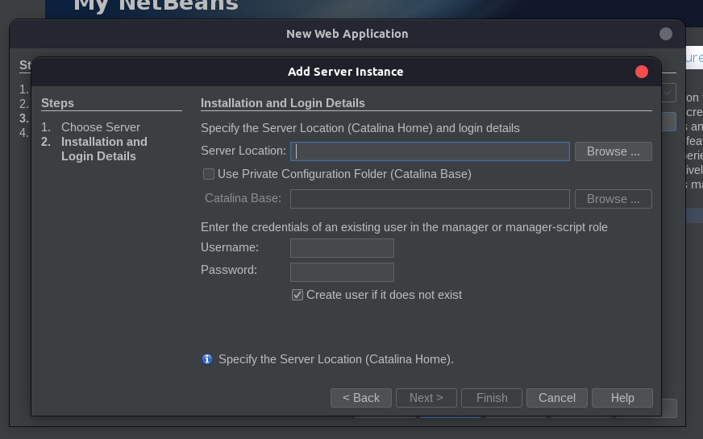

3. Se você seguiu o que foi orientado anteriormente, navegue até Documentos, entre na pasta Servers e selecione o Apache Tomcat que você extraiu, configure um usuário e uma senha, o resultado ficará mais ou menos assim:

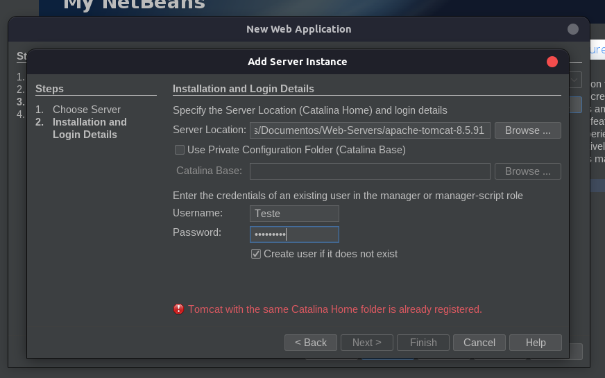

clique em Finish e seu servidor estará configurado.

> Obs.: O meu está dando erro porque eu já tenho o mesmo servidor criado, ai eu teria que apagar o que eu já tenho para criar um novo, mas só estou mostrando para fins de didática.

Com o seu servidor configurado, agora sim, a sua tela ficará mais ou menos como mostrado anteriormente, assim:

clique em *Next* e depois *Finish*, ou somente em *Finish*.

> Obs.: O context path irá ser alterado de acordo com o nome que você selecionar para o seu projeto, o meu está com o nome padrão que já vem, mas é recomendável trocar esse nome para outro de sua preferencia.

Após a IDE terminar o seu trabalho, o esqueleto do seu projeto deverá se parecer, mais ou menos, com isso:

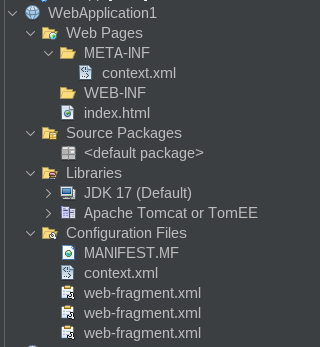

### 🐬 - Adicionando o Connector/J do MySQL

Já iremos adicionar o Connector/J do MySQL para facilitar nossa vida, primeiro clique com o botão direito do mouse em cima de ***Libraries*** e clique em: ***Add JAR/Folder***

abrirá uma tela semelhante a está:

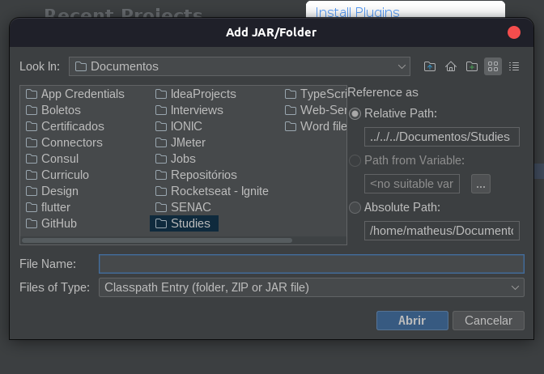

Vá até documentos, caso não estiver, navegado pela barra grande de cima, e entre no, caso tenha seguido o passo sugerido lá em cima na seção de download do mysql connector, diretório Connectors, irá aparecer o seu connector, o *8.0.17*:

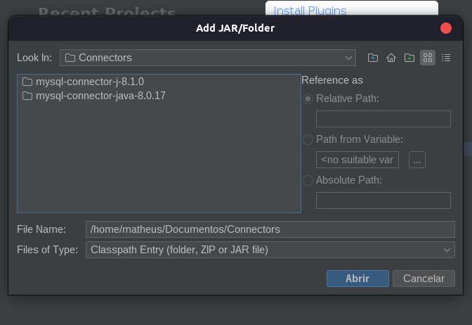

de um duplo clique no connector que termina com ***8.0.17*** e irá ser redirecionado para:

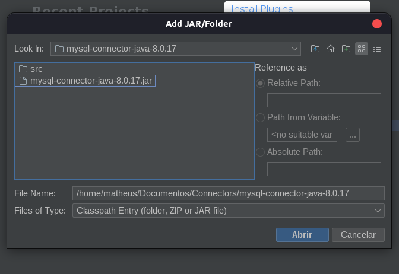

ai está o arquivo que buscamos, **clique em .jar e clique em abrir**.

Note que o connector já foi adicionado em Libraries:

### 🏦 🎲 - Criação do Banco de dados

Para esse projeto estou usando o seguinte script sql:

~~~ sql
CREATE DATABASE 4Log;

USE 4Log;

CREATE TABLE product(
    lg_code VARCHAR(36) PRIMARY KEY,
    lg_name VARCHAR(50) NOT NULL,
    lg_brand VARCHAR(50) NOT NULL,
    lg_price DOUBLE NOT NULL,
    lg_createdAt DATETIME NOT NULL
);

ALTER TABLE 4Log.product CONVERT TO CHARACTER SET utf8mb4 COLLATE utf8mb4_unicode_ci;

SELECT * FROM 4Log.product;

INSERT INTO 4Log.product (4Log.product.lg_code, 4Log.product.lg_name, 4Log.product.lg_brand, 4Log.product.lg_price, 4Log.product.lg_createdAt) VALUES (UUID(), "Televisão", "Toshiba", 2000.00, NOW());
INSERT INTO 4Log.product (4Log.product.lg_code, 4Log.product.lg_name, 4Log.product.lg_brand, 4Log.product.lg_price, 4Log.product.lg_createdAt) VALUES (UUID(), "LG Smart TV 50' OLED 4k", "LG", 3875.00, NOW());
~~~

Use-o para ficar mais fácil de seguir o passo a passo, porém, caso precise alterar não tem problemas, somente lembre de fazer as alterações necessárias no código fonte.

> Nota: Eu acho interessante salvar uma migração do banco de dados atual, então sempre crio uma pasta model/migrations dentro do src, caso queira guardar essa migration também, faça o que mostrarei a seguir.

### 🕗 - Migrations (Opcional)

Podemos salvar as versões do banco de dados ao longo do ciclo de vida do sistema, podemos criar, dentro da pasta **Source Packages**, a famosa **src** (Source), uma nova pasta com o nome de migrations. Estamos usando MVC, logo cada uma das siglas significa algo diferente, um resumo que eu gosto de falar para quem está iniciando:

- M: Model (Regra de negócio);
- V: View (Apresentação);
- C: Controller (Requisições).

uma pasta de migrations não seria nem uma camada de apresentação e não estaria trabalhando com rotas então só sobra Model.

Clique com o botão direito em: **Source Packages** e clique em **New > Folder**:

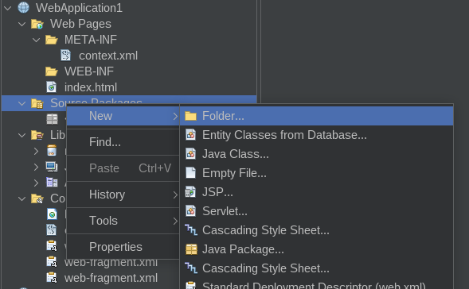

irá aparecer a seguinte tela:

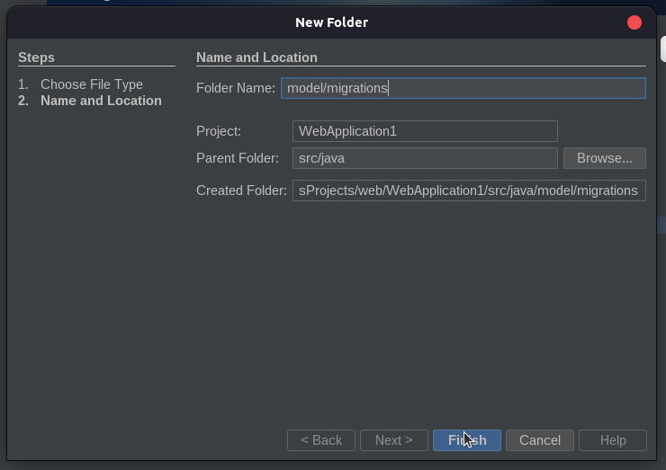

de o seguinte nome para a pasta: **model/migrations** e clique em *Finish*.

Crie um arquivo em branco, sim, um arquivo .txt:

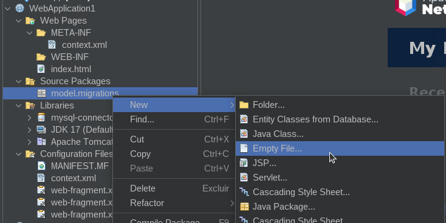

> Obs.: Caso não ache, é so pesquisar usando o ***Other***.

nomeie o arquivo como: **v1.database.migration** e clique em *Finish*, ficará mais ou menos assim:

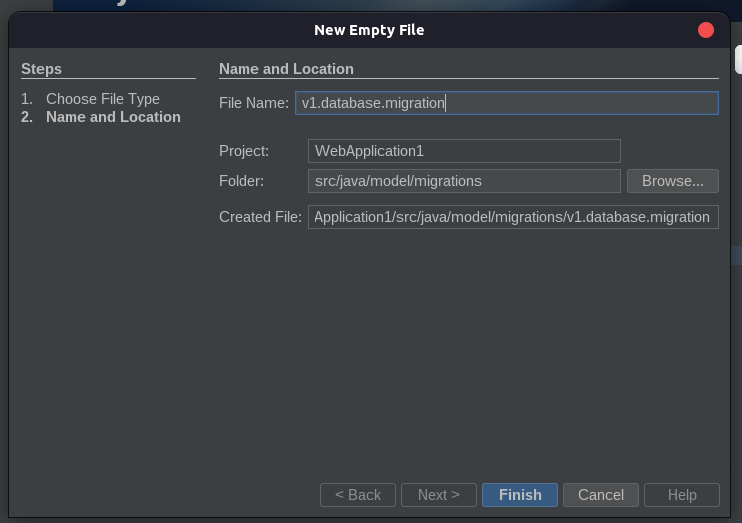

caso tenha feito o seu proprio script de banco de dados, cole-o lá, se tiver seguindo o meu script, pegue ele lá em cima e cole dentro do arquivo *.txt* que acabou de criar.

### 📄 - Páginas com JSP

Para esse projeto iremos utilizar o tipo de arquivo **JSP**, pois ele aceita código Java misturado com o HTML nativo.

Dentro de Web Pages é possivel notar que existe um arquivo **index.html**, exclua esse arquivo e crie um arquivo: **index.jsp**.

Para criar é bem simples, assumindo que você já excluiu o *index.html*, clique com o botão direito em cima de Web Pages e selecione: New > JSP...

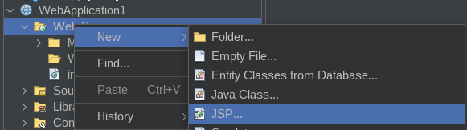

clique, renomeie o nome do arquivo para **index** e clique em *Finish*.

ele será mais ou menos assim:

~~~ html
<%-- 
    Document   : index
    Created on : 19 de out. de 2023, 15:36:32
    Author     : your computer name
--%>

<%@page contentType="text/html" pageEncoding="UTF-8"%>
<!DOCTYPE html>
<html>
    <head>
        <meta http-equiv="Content-Type" content="text/html; charset=UTF-8">
        <title>JSP Page</title>
    </head>
    <body>
        <h1>Hello World!</h1>
    </body>
</html>
~~~

o seu projeto ficará assim:

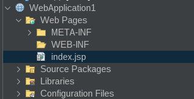

essa será a única página necessária para a nossa aplicação.

### 🎮 - Controller

Precisamos de um interceptador de requisições, um controlador, no JavaEE, **um servlet**. O Servlet será o responsável por interceptar as requisições, para determinados end-points e tratar as lógicas necessárias.

Ao se trabalhar com HTTP existem 4 métodos principais:

- Get (Pegar);
- Post (Publicar);
- Put (Editar);
- Delete (Deletar).

no JavaEE cada método HTTP é reconhecido pelo nome do método na classe Java, por incrivel que pareça, pode testar da maneira que quiser, é pura mágica!

A nomeclatura do JavaEE é a seguinte: 

**do** + tipo do método HTTP, exemplo:

- Get (doGet);
- Post (doPost);
- Put (doPut);
- Delete (doDelete).

criaremos nossa primeira, e única, controller, para isso, clique com o botão direito em: **Source packages** e vá em: **New > Servlet**:

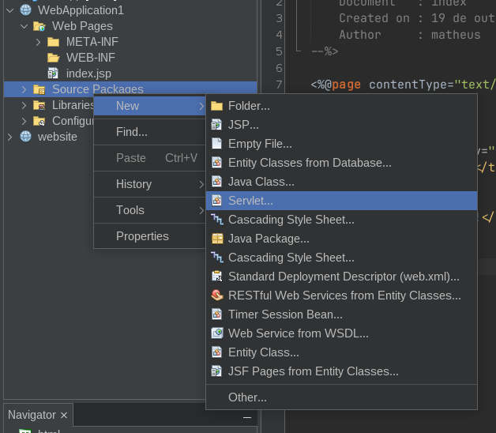

irá abrir uma página como essa:

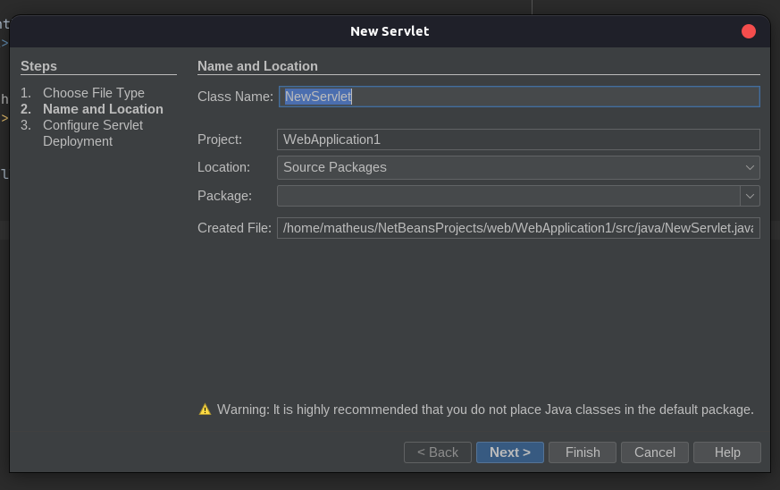

troque o **Class Name** para **ProductController** (boa prática), adicione **controller** no campo **Package**, o resultado será esse:

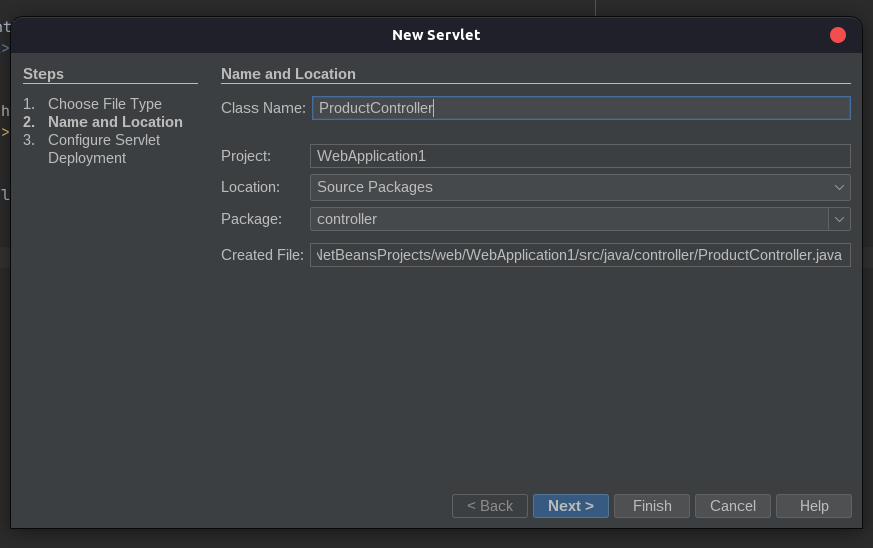

Você irá ser redirecionado para uma tela assim:

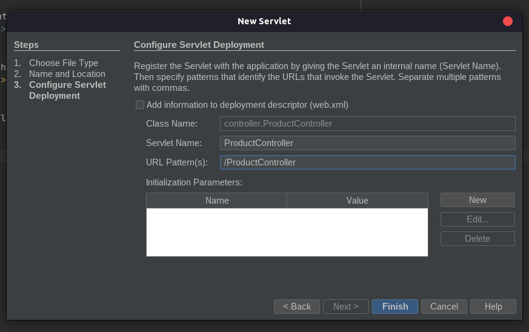

troque **/ProductController** para **/products** (boa prática)

quando abrir o arquivo, limpe ele, até que sobre somente os métodos: doPost, doGet, getServletInfo e processRequest, o meu ficou assim:

~~~ java
package controller;

import java.io.IOException;
import javax.servlet.ServletException;
import javax.servlet.annotation.WebServlet;
import javax.servlet.http.HttpServlet;
import javax.servlet.http.HttpServletRequest;
import javax.servlet.http.HttpServletResponse;

@WebServlet(name = "ProductController", urlPatterns = {"/products"})
public class ProductController extends HttpServlet {

    protected void processRequest(HttpServletRequest request, HttpServletResponse response) throws ServletException, IOException {
        response.setContentType("text/html;charset=UTF-8");
    }

    @Override
    protected void doGet(HttpServletRequest request, HttpServletResponse response) throws ServletException, IOException {
        processRequest(request, response);
    }

    @Override
    protected void doPost(HttpServletRequest request, HttpServletResponse response) throws ServletException, IOException {
        processRequest(request, response);
    }

    @Override
    public String getServletInfo() {
        return "Product controller";
    }

}
~~~

note que:

- [X] - processRequest: irá trazer configurações padrões para requisições e respostas (esse método não é obrigatório, mas é uma boa pratica ter ele);
- [X] - doGet: irá ser o método que irá ser acionado com uma requisição do tipo GET;
- [X] - doPost: o mesmo de cima, porém com o método POST;
- [X] - getServletInfo: retornará informações sobre o seu Servlet, você pode colocar qualquer coisa de relevante (esse método não é obrigatório, mas é uma boa pratica ter ele).

### 🧠 - Services

As services são o coração, o cerebro, o corpo, a alma do seu código, dentro dela está tudo que o código é necessário para funcionar.

Dentro de **src**, daqui pra frente irei tratar a pasta **Source Packages** como **src**, crie uma **nova Java Class** com o nome de **ProductService** (boa prática) e troque o pacote para model/service (boa prática):

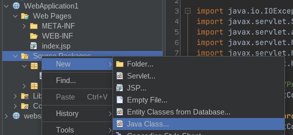

ficará assim: 

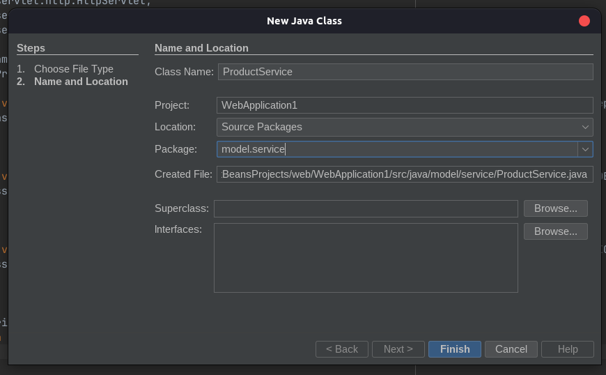

clique em *Finish*.

### 📚 - Repositories (ou DAO)

Os repositorios, ou DAO, são responsáveis por criar a conexão com o banco de dados e me retornar determinados dados, se sua DAO faz algo mais do que: criar a conexão e retornar os dados, sua DAO está totalmente errada.

faça o mesmo que fez no passo anterior, porém, ao invés de **ProductService** nomeie a classe Java como **ProductRepository** e troque o nome do pacote para **model/repository**, ficará assim:

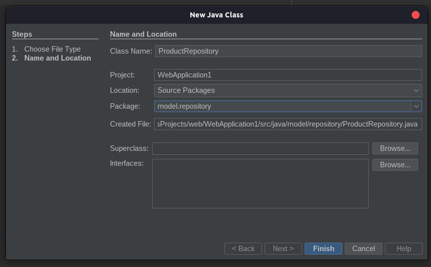

> Obs.: Não esquece de limpar os comentários do Netbeans, ninguém merece essa porcaria no código em...

### ⚽ - Puxando as tabelas do banco de dados

(mó emoji nada haver, estou sem criatividade).

Precisamos puxar a tabela que criamos la do banco de dados, para isso precisamos, dentro de **src** , criar uma **Entity class from database**, para isso:

clique em **src** e vá em: **New > Entity Class from Database**:

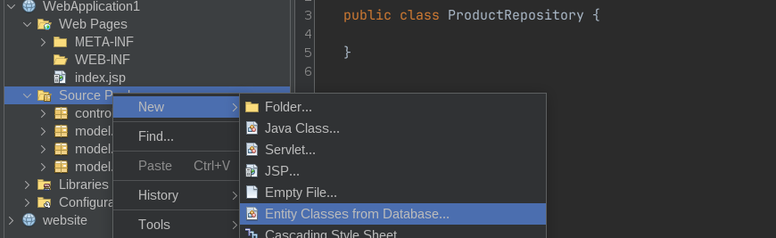

ao clicar, irá ser redirecionado para:

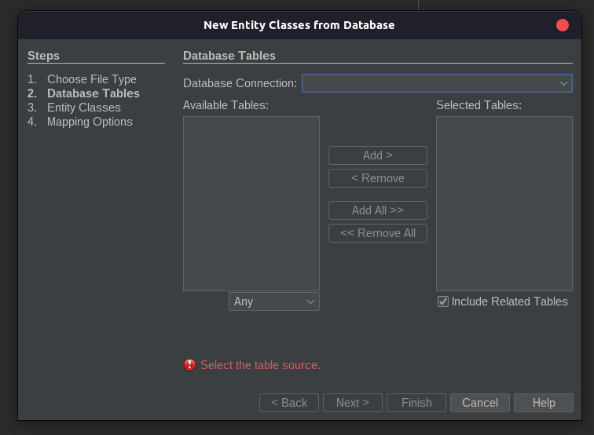

clique nesse retangulo que está meio azulado e clique em: **New Database Connection**:

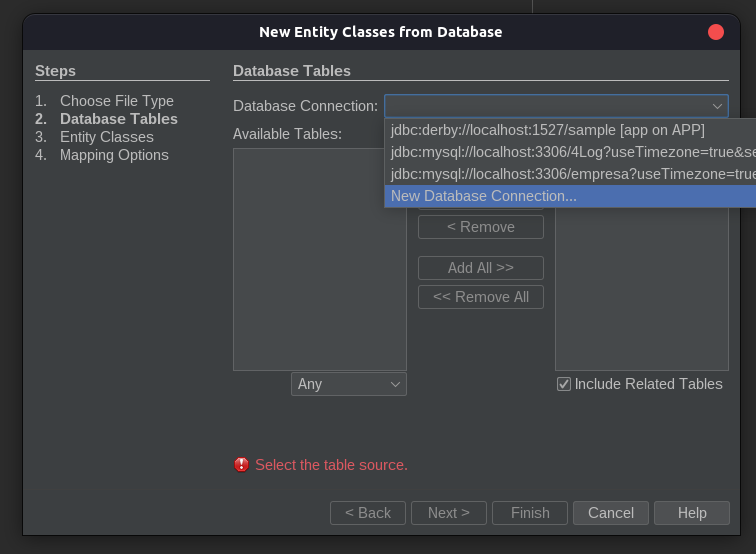

selecione **MySQL Connector/J driver**

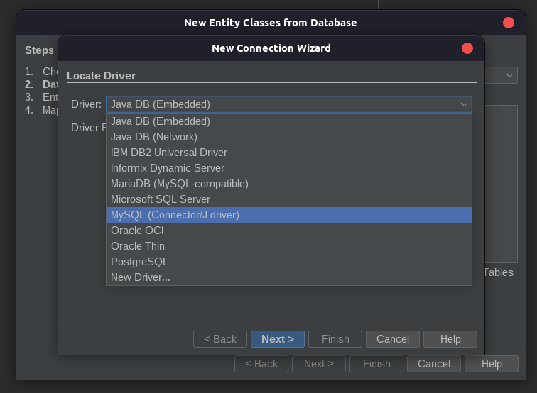

e o seu driver já estará lá, caso não esteja é so adicionar, já ensinei isso antes, essa tela deverá ficar assim: 

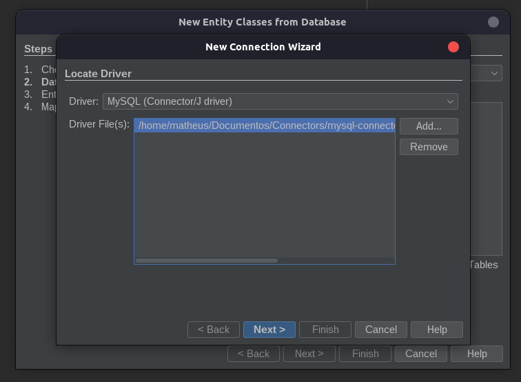

clique em *Next* e verá a seguinte tela:

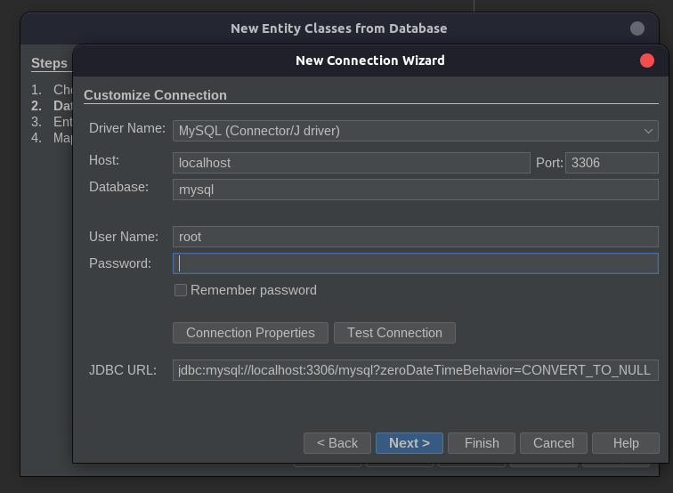

altere o username e o password para as configurações que você predefiniu em seu computador, caso esteja no Senac, coloque as configurações de MySQL do Senac que nós já sabemos qual é.

**em Database coloque o nome do seu banco de dados**, se estiver seguindo o script que eu coloquei acima, troque o campo **Database** para **4Log**

#
**>>>>> apague o *?zeroDateTime...*, para frente, do JDBC URL**
#

**troque por:**
#
**?useTimezone=true&serverTimezone=UTC&useUnicode=yes&characterEncoding=UTF-8**

clique em *Next*, *Next* denovo, e *Finish*. Se tudo der certo, irá mostrar as tabelas do seu banco de dados, no nosso caso: Product

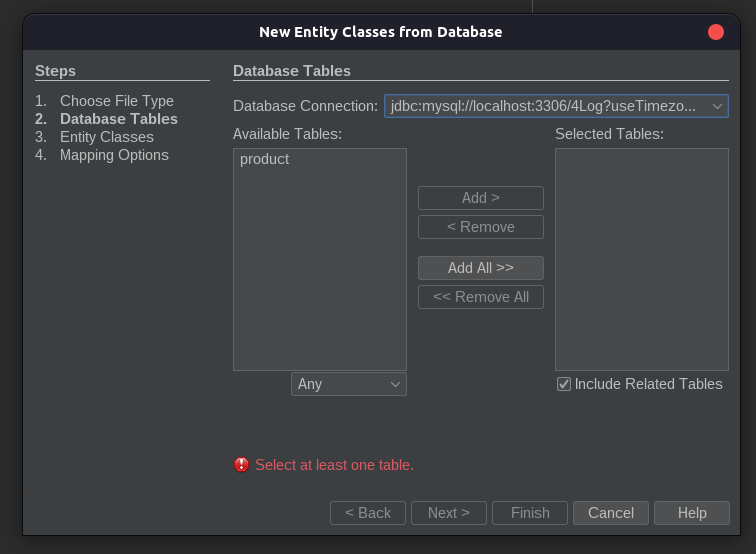

Selecione **"product"** e **clique em Add >** e clique em *Next*, **atualize o nome do pacote para model.domain**:

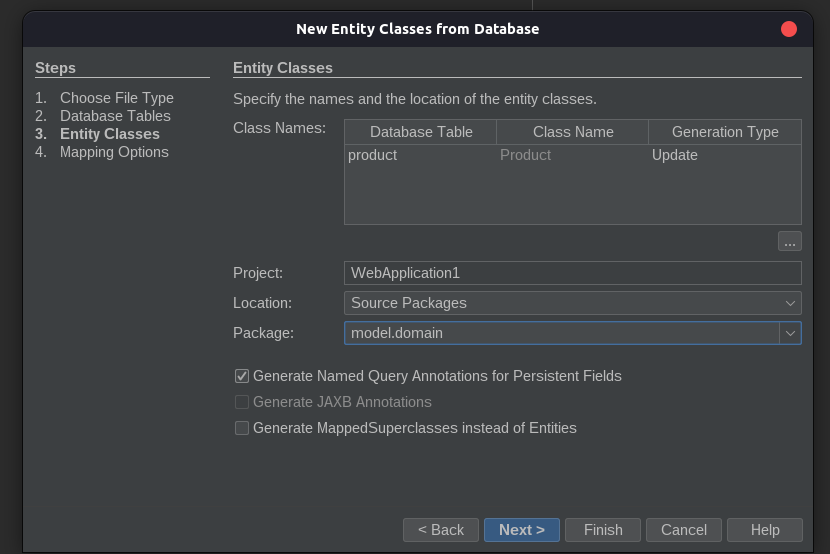

de *Next* novamente e irá cair nessa tela:

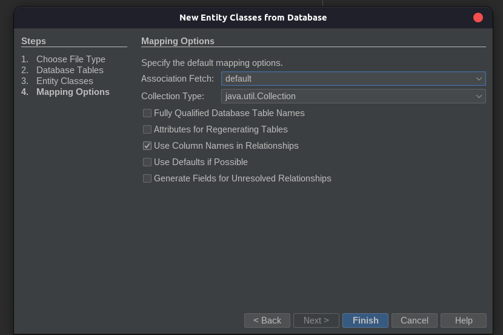

**troque** de **Collection para List**:

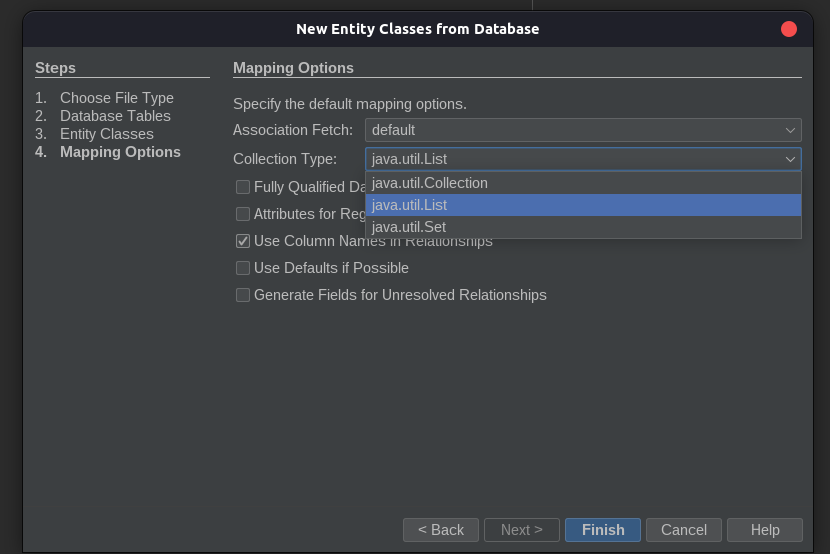

e clique em *Finish*, já é para aparecer a classe ProductList lá certinho.

> Obs.: Pode tirar os comentários se quiser, exclua o toString da classe Product e gere um novo com **Alt + Insert > toString()**.

### 📈 - Database Connection

Precisamos de uma classe que irá fornecer a conexão com o banco de dados, para isso, em **src**, crie uma **Java Class** dentro de **src** no pacote **model/config** e de o nome de **Connection**

cole o seguinte código dentro dela:

~~~ java
package model.config;

import javax.persistence.EntityManager;
import javax.persistence.EntityManagerFactory;
import javax.persistence.Persistence;

public class Connection {
    private final EntityManager entityManager;
    private final EntityManagerFactory entityManagerFactory;
    
    public Connection() {
        this.entityManagerFactory = Persistence.createEntityManagerFactory("websitePU");
        this.entityManager = entityManagerFactory.createEntityManager();
    }
    
    public EntityManager getConnection() {
        return this.entityManager;
    }
    
}
~~~

resumindamente: o único método importante é o getConnection, ele irá ser o método que nós dará possibilidade de "conversar" com o banco de dados.

### 🖊️ - Métodos do Repository

Como já temos o método getConnection, podemos, enfim, implementar os métodos de findAll e save, os que realmente importam para nós, e já deixarmos ele prontos para uso,

vá ate o seu arquivo ProductRepository, ou similar, e escreva os seguintes métodos:

~~~ java
package model.repository;

import java.util.List;
import javax.persistence.TypedQuery;
import model.domain.Product;
import model.config.Connection;

public class ProductRepository {

    private final Connection connection;
    
    public ProductRepository() {
        this.connection = new Connection();
    }
    
    public List<Product> findAll() {
        String JPQLQuery = "SELECT p FROM Product p"; 
        TypedQuery<Product> query = this.connection.getConnection().createQuery(JPQLQuery, Product.class);
        return query.getResultList();
    
    }
    
    public void save(Product newProduct) throws Exception {
        this.connection.getConnection().getTransaction().begin();
        this.connection.getConnection().persist(newProduct);
        this.connection.getConnection().getTransaction().commit();
    }
    
}

~~~